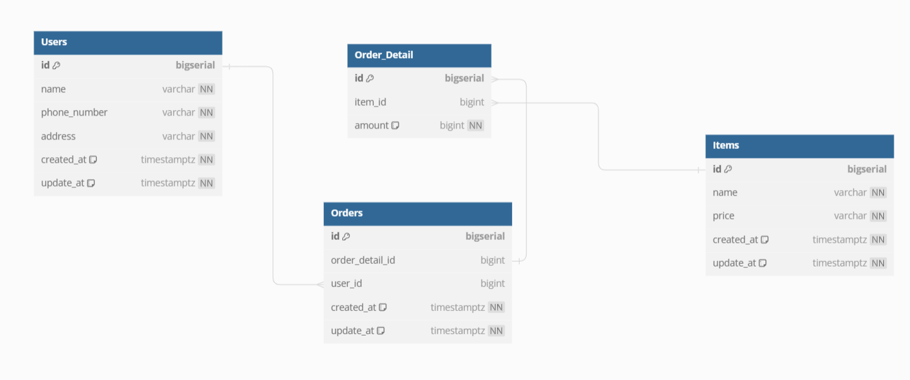

## Getting started

Below we describe the conventions or tools specific to the project.

### Layout

```tree
.
├── cmd
│   └── main.go
├── config.yaml
├── Dockerfile
├── go.mod
├── go.sum
├── __init__.py
├── internal
│   ├── adapter
│   │   └── token_master_data
│   │   │   ├── client.go
│   │   │   └── types.go
│   │   └── redis
│   │       ├── constants.go
│   │       └── impl.go
│   ├── command
│   ├── constants
│   │   ├── dex.go
│   │   └── swap.go
│   ├── interceptor
│   │   └── tracing.go
│   ├── model
│   │   ├── dexs.gen.go
│   │   ├── order_addresses.gen.go
│   │   └── swaps.gen.go
│   ├── repo
│   │   ├── dex.go
│   │   ├── order_address.go
│   │   ├── swap.go
│   │   └── uow
│   │       └── uow.go
│   ├── service
│   │   ├── get_dex_transaction_history.go
│   │   ├── get_dexs.go
│   │   ├── get_swappable_tokens.go
│   │   ├── register_gen.go
│   │   ├── service.go
│   │   └── submit_dex_transaction.go
│   ├── tests
│   │   ├── factory
│   │   │   └── factory.go
│   │   ├── setup.go
│   │   └── test_suite.go
│   └── utils
│       ├── address_utils
│       │   └── address.go
│       ├── array_utils
│       │   └── array.go
│       ├── asset_utils
│       │   └── asset.go
│       ├── datetime.go
│       ├── epoch.go
│       ├── epoch_test.go
│       ├── out_ref.go
│       ├── protobuf_wrapper
│       │   └── protobuf_wrapper.go
│       ├── sets.go
│       └── set_utils
│           └── set.go
├── Makefile
├── migrations
├── pkg
│   ├── config
│   │   ├── config_gen.go
│   │   ├── config.go
│   │   └── logger.go
│   ├── data
│   │   └── crud.go
│   ├── db
│   │   ├── db.go
│   │   └── gorm.go
│   ├── migrate
│   │   └── mysql.go
│   └── testcontainer
│       └── mysql.go
└── README.md

```

A brief description of the layout:
* `Makefile` is used to build the project
* `README.md` is a detailed description of the project.
* `bin` is to hold build outputs.
* `cmd` contains main packages, main.go is the start point of the project.
* `internal` places most of project business logic and locate `api` package.
* `internal/adapter` provides adapter interface which helps BFF to communicate with others services
* `internal/command` contains all commands using in the app (not main app)
* `internal/constants` contains constants
* `internal/interceptor` includes all decorators and middlewares
* `internal/model` defines models of Danogo Bond
* `internal/repo` provides interface for interacting with data
* `internal/service` defines API business logic
* `internal/tests` configures test suite base and essentials for test
* `internal/utils` contain util functions
* `migrations` contains SQL migrations
* `pkg` holds config, db connection

### ERD
